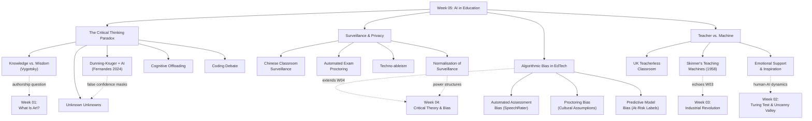

# 📚 PHKI Week 05 — AI in Education

| Field | Detail |
|---|---|
| **Module** | Philosophy, Art & AI (PHKI) — HSLU FS26 |
| **Week / Date** | Week 05 · 17 March 2026 |
| **Lecturer** | Catherine Hayden (CH) |
| **Topic** | AI in Education |
| **Sources** | Pre-class slides (28 pp.), Post-class slides (27 pp.), class notes |

> [!NOTE]
> **AI-use disclosure:** This summary was compiled with the assistance of an AI tool (Google Gemini). The AI extracted text from lecture PDFs, organised themes, and helped draft prose. All content was reviewed, restructured, and verified against the original slides and class notes by the student. Any errors remain the student's responsibility.

---

## 1 · Learning Objectives

By the end of this week, students should be able to:

1. **Explain** how AI is reshaping learning and assessment.
2. **Participate** in a debate about the value of human skills in an AI-assisted world.
3. **Critically evaluate** risks associated with AI in education (overreliance, surveillance, algorithmic bias).
4. **Reflect** on authorship and learning when AI tools are used.
5. **Connect** AI in education to wider societal and technological change.

---

## 2 · Key Concepts & Definitions

### 2.1 Knowledge vs. Wisdom

The lecture opened with a foundational distinction between two modes of learning:

| Dimension | Knowledge | Wisdom |
|---|---|---|
| **Activities** | Memorising, summarising, solving well-defined problems | Critical judgement, synthesis, application in new contexts, articulating personal values |
| **Outputs** | Facts, formulas, defined answers | Nuanced reasoning, ethical reflection, creative insight |
| **AI's strength** | High — AI excels at retrieving and organising facts | Low — wisdom requires lived experience and social interaction |

> **Vygotsky's Constructivism:** *"Knowledge is actively built by the learner through experience and social interaction, not passively received."*

**Why it matters for the module:** If AI is better at delivering *knowledge* than cultivating *wisdom*, then we must ask what role the human learner — and the human teacher — still plays. This distinction underpins every subsequent section of the lecture.

---

### 2.2 The Critical Thinking Paradox

A central paradox emerges when GenAI is used in education:

**Thomas Wolf's argument** (Hugging Face co-founder, blog post: [The Einstein AI Model](https://thomwolf.io/blog/scientific-ai.html)):
- AI is good at processing and summarising knowledge but **lacks the ability to think independently, challenge paradigms, or generate truly novel insights**.
- AI cannot yet replace **human intuition and contrarian thinking** in scientific and intellectual breakthroughs.
- If AI tools primarily **reinforce existing knowledge**, they may stifle innovation in education.

The lecture presented a balanced evidence table:

| Risks of Overreliance / Cognitive Offloading | Potential for Enhancement |
|---|---|
| Students may use GenAI as a **substitute** for developing their own reasoning and evaluation skills (Chan & Lee, 2023) | Students recognise the importance of **balancing** GenAI use with independent research (Adams et al., 2023; Kartal, 2024) |
| Frequent AI use may **reduce deep understanding** of advanced concepts and logical reasoning, diminishing critical thinking when AI *replaces* rather than *supports* cognitive processes (Guo & Lee, 2023) | AI may **enhance** critical thinking by freeing time and mental capacity for complex reasoning tasks rather than routine work (Essien et al., 2024) |
| AI's limitations in complex reasoning and tendency to produce **biased or inaccurate** outputs may restrict how effectively it can support critical thinking development (Wang & Fan, 2025) | GenAI appears most effective when used as an **interactive tutor** rather than an answer generator, particularly when educators provide learning scaffolds or structured frameworks (Wang & Fan, 2025) |

> **Key takeaway:** *"The research suggests AI's impact on critical thinking is not predetermined — it depends on how students use it and how educators structure that use."*

---

### 2.3 Unknown Unknowns & AI

The lecture introduced a three-tier knowledge framework (often attributed to Donald Rumsfeld, but rooted in epistemology):

| Category | Definition | Relation to AI |
|---|---|---|
| **Known knowns** | Things we understand | AI can help retrieve and confirm these |
| **Known unknowns** | Things we know we need to learn | AI can help address these if prompted correctly |
| **Unknown unknowns** | Gaps in knowledge we are not aware of | **The hardest to address** — "you can't ask questions about something you're not aware of" |

**AI amplifies the danger of unknown unknowns:** With hallucinations and unforeseen side-effects, many of GenAI's most serious failures are unknown unknowns. When students rely heavily on AI, they may receive answers without realising what they do not understand or what is missing.

> **Critical question:** *How might critical thinking, and especially media/AI literacy, help students notice that there might be a problem even when everything looks fluent and correct?*

---

### 2.4 The Dunning-Kruger Effect & GenAI Overconfidence

**Background:** The Dunning–Kruger effect is a cognitive bias in which novices overestimate their competence in a domain, while experts may underestimate theirs (Kruger & Dunning, 1999).

**AI twist** — Fernandes et al. (2024) study ([arXiv:2409.16708](https://arxiv.org/html/2409.16708v1)):
- The research found that AI use creates a new variant of the Dunning-Kruger effect: users who rely on AI tools **feel more competent** than they actually are.
- Participants demonstrated **cognitive offloading** — outsourcing thinking to AI tools rather than developing their own understanding.
- More AI-literate users were not necessarily less overconfident; in some cases, familiarity with AI tools **increased** unjustified confidence.

**Connection to unknown unknowns:** Overconfidence means students do not seek to verify AI outputs and remain unaware of gaps — the AI-generated text *looks* fluent and correct, masking real deficiencies.

> **Popularised article:** *"AI Is Causing a Grim New Twist on the Dunning-Kruger Effect"* — [Futurism](https://futurism.com/artificial-intelligence/ai-dunning-kruger-effect)

---

### 2.5 Cognitive Offloading

**Definition:** Cognitive offloading is the process of outsourcing mental tasks to external tools (calculators, notes, AI) rather than performing them internally. In the AI context, it refers to students delegating reasoning, synthesis, or evaluation to GenAI tools.

**Risks:**
- Loss of deep processing and long-term retention
- Students may complete tasks faster but learn less
- Erosion of the very skills (critical thinking, problem-solving) that education aims to develop

**Nuance:** Some degree of cognitive offloading is productive — it frees mental capacity for higher-order tasks. The question is *where the line falls* between enhancement and dependency.

---

## 3 · Key Arguments & Positions

### 3.1 In-Class Debate: "Coding With or Without AI?"

**Motion:** *"Students should avoid using code-assist tools for most assignments until they can code without AI."*

| FOR — Avoid AI Until You Can Code Without It | AGAINST — Support AI-Assisted Coding from the Start |
|---|---|
| Builds foundational understanding of logic, syntax, and debugging | AI tools are already integral to industry; learning with them is realistic |
| Prevents cognitive offloading before core skills are developed | AI can scaffold learning by providing examples and explanations in context |
| Students who rely on AI early may struggle when AI fails or produces errors | Restricting AI creates an artificial learning environment disconnected from practice |
| Understanding *why* code works is essential for debugging and innovation | Students can learn to critically evaluate AI suggestions, developing meta-skills |
| Overreliance mirrors the Dunning-Kruger findings — false confidence without competence | Banning AI may discourage students who learn differently or have accessibility needs |

> **From class notes:** This debate directly connects to the Dunning-Kruger discussion. Both sides agree that *critical evaluation of AI outputs* is essential — the disagreement is about *when* AI should be introduced.

---

### 3.2 Critical Questions — Three Lenses

The lecture framed critical reflection through three lenses:

1. **Personal practice:** *"Given this evidence, how do you need to use GenAI if you want it to enhance rather than erode your critical thinking?"*
2. **Societal risks:** *"Outside of university, where might weak critical thinking + powerful GenAI tools create serious problems for society?"* (e.g., news, politics, social media)
3. **Media literacy & education:** *"How should universities and societies teach and support AI literacy so that GenAI tools strengthen, rather than weaken, our collective capacity for critical thinking?"*

> **Quote (slide):** *"The saddest aspect of life right now is that science gathers knowledge faster than society gathers wisdom."* — Isaac Asimov (1988)

---

## 4 · Surveillance & AI in Education

### 4.1 "Has Big Brother Entered Our Classrooms?"

The lecture presented a case study of **AI surveillance in Chinese schools** (2018–2019), where students wore brain-monitoring headbands that tracked attention levels in real time.

**Discussion questions from the slides:**
1. What human decisions had to be made for this AI monitoring system to exist?
2. How should societies decide what kinds of AI monitoring are acceptable in education?
3. If you were a student in that classroom, how might it change the way you behave or learn?
4. Who benefits most — students, parents, teachers, the state, or technology companies? Who carries the risks?
5. If this represents the extreme end of surveillance, what lighter forms of monitoring already exist in your own learning?

> **Key principle:** *"Societies and human decisions shape how technologies are used."*

**Video reference:** WSJ clip on Chinese classroom surveillance — [YouTube](https://youtu.be/JMLsHI8aV0g?si=Pbnzy0EdC82GMD2l)

---

### 4.2 Automated Exam Proctoring

**What these systems do:**
- AI-based proctoring monitors students via webcam, screen capture, and behaviour-detection algorithms.
- Software flags "suspicious behaviour" such as looking away from the screen, unusual movements, or multiple people in the room.

**How students experience them:**
- Many accept some monitoring to prevent cheating, but studies describe a **"cycle of anxiety"**: students suppress natural behaviours (e.g., fidgeting or stimming) to avoid being falsely flagged (Kwapisz et al., 2025).
- Students report discomfort about being recorded in private spaces and uncertainty about who sees their data.

**Ethical concerns:**
- **Techno-ableism:** behaviours linked to disability or neurodiversity can be misread as suspicious.
- **False positives:** innocent behaviour is sometimes treated as cheating, shifting the burden of proof onto students.
- **Privacy:** intrusive recording in bedrooms or shared homes raises questions about consent and data protection.

> **Design principle (Kwapisz et al., 2025):** Educational technologies should be designed *"for a spectrum of abilities from the start, rather than retrofitting accessibility later."*

**Further reading:** [Online Exam Monitoring Can Invade Privacy and Erode Trust at Universities](https://theconversation.com/online-exam-monitoring-can-invade-privacy-and-erode-trust-at-universities-149335)

---

### 4.3 Discussion Beyond the Classroom

The lecture raised the broader implications of normalising surveillance in education:

- **Habituation:** If AI surveillance becomes normal in schools, people may later accept similar monitoring in the workplace and everyday life.
- **Values erosion:** Widespread monitoring may reshape our values around privacy, trust, and individual freedom.
- **Designer responsibility:** As future professionals, students should consider what concrete choices they can make to ensure AI tools support safety and learning rather than drifting into invasive monitoring.

---

## 5 · Algorithmic Bias in Education

Drawing on Baker & Hawn (2022), the lecture presented three domains of algorithmic bias in educational AI:

| Bias Domain | Example | Why It Matters |
|---|---|---|
| **Automated assessment** | SpeechRater rated Chinese students higher and German students lower than their actual English proficiency (Wang et al., 2018) | Students from certain linguistic backgrounds are graded unfavourably by the algorithm, regardless of actual competence, creating unequal opportunities |
| **Exam proctoring** | American coders misread Turkish students' facial expressions due to U.S. cultural assumptions (Okur et al., 2018). Proctoring systems describe a "cycle of anxiety" where students suppress natural behaviours (Kwapisz et al., 2025) | Students whose appearance, culture, or neurodiversity does not match the system's assumptions are more likely to be misread and flagged, increasing the risk of unfair cheating accusations |
| **Predictive models** | Course-failure models performed worse for African-American students (Hu & Rangwala, 2020). Higher false positives for White students and higher false negatives for Latino students in graduation prediction (Anderson et al., 2019) | Biased predictions can label some students as "at risk" or "safe" incorrectly, shaping who gets support and reinforcing existing inequalities |

> **Connection to Week 04:** This directly extends the Critical Theory and algorithmic bias discussion from last week (Gender Shades study, structural inequality in AI systems). Education is another domain where "neutral" technology can reproduce and amplify existing social hierarchies.

---

## 6 · Teacher vs. Machine

### 6.1 Historical Context: Skinner's Teaching Machines (1958)

B.F. Skinner's 1958 paper *"Teaching Machines"* proposed the idea of computers as personalised tutors. The concept is **not new** — what has changed is the sophistication of AI.

> *"Reaction to Skinner's thinking machines ranged 'from excitement and wonder to fear and anger about the mechanization of schools and the dehumanization of the student-teacher relationship.'"* — Ferster (2014, p.77)

**Skinner's legacy is controversial:** He was influential in psychology for his work on behaviourism and reinforcement learning, but his emphasis on controlling behaviour through conditioning raised ethical concerns — echoing today's debates about AI-driven personalised learning.

**The modern reignition:** Major advances in AI and the widespread public availability of AI tools have reignited the debate of machines and personalised tutoring, sparking new questions about the balance between technology and human interaction in learning environments.

---

### 6.2 Human vs. Machine — Key Questions

The lecture posed three fundamental questions:

1. **Emotional support:** Can AI support you emotionally or push your thinking like a teacher?
2. **Inspiration:** Does AI have the capacity to inspire you the way a great teacher might?
3. **Engagement & creativity:** Without a human teacher, what happens to your level of engagement and creativity?

**Video reference:** Sky News — *"The UK's First 'Teacherless' Class"* — [YouTube](https://youtu.be/MHFCVbUcwIE?si=K4SigLrU2ksHXnbD)

---

### 6.3 Food for Thought

> *"Will automation and AI lead to a post-work society where leisure, creativity, and human connection take precedence, or will it create a dystopian future of widespread unemployment and disenfranchisement?"*

---

## 7 · Art, Media & Cultural References

| # | Reference | Type | Relevance |
|---|---|---|---|
| 1 | Thomas Wolf, *"The Einstein AI Model"* (2025 blog post) | Blog / Essay | Argues AI cannot replace human intuition and contrarian thinking in scientific breakthroughs; used to frame the critical thinking paradox |
| 2 | *"AI Is Causing a Grim New Twist on the Dunning-Kruger Effect"* (Futurism) | Popular article | Accessible summary of Fernandes et al. (2024) on AI-induced overconfidence |
| 3 | WSJ clip — Chinese classroom surveillance (brain-monitoring headbands) | Documentary clip | Case study of extreme AI surveillance in education (2018–2019) |
| 4 | Sky News — *"The UK's First 'Teacherless' Class"* | News report | Example of AI replacing human teachers entirely — raises questions about engagement, emotional support, and the role of human interaction in learning |
| 5 | B.F. Skinner's Teaching Machine (1958) | Historical artefact | Shows that the idea of machines replacing teachers dates back to the 1950s; contextualises today's AI-in-education debate as part of a longer pattern |
| 6 | George Orwell, *Nineteen Eighty-Four* (1949) — "Big Brother" | Literary reference | Implicit reference through the "Has Big Brother entered our classrooms?" framing of the surveillance discussion |
| 7 | Isaac Asimov quote (1988) | Literary quotation | *"Science gathers knowledge faster than society gathers wisdom"* — frames the gap between technological capability and societal readiness |

---

## 8 · Discussion Blocks

### 8.1 🧠 Block A — "What Is Learning?"
> Does learning mean acquiring **knowledge** or cultivating **wisdom**? Which of these two is AI better at helping us do?

**Your position:** *(Reflect here)*

**Possible angles:**
- Vygotsky's constructivism suggests learning is social and experiential — AI is inherently non-social (unless designed to simulate it)
- AI is excellent at knowledge delivery but struggles with the contextual, values-laden judgement that constitutes wisdom
- The lecture's distinction parallels Bloom's taxonomy: AI handles lower-order tasks (remember, understand) but students need practice at higher-order tasks (evaluate, create)

---

### 8.2 🧠 Block B — "Coding with or without AI?"
> Should students avoid code-assist tools until they can code independently?

**Your position:** *(Reflect here)*

**From class notes — key arguments discussed:**

**Pro (avoid AI early):**
- If you depend on AI before building fundamentals, you develop a false sense of competence (links to Dunning-Kruger)
- Debugging and problem-solving skills atrophy when AI handles them

**Con (embrace AI from the start):**
- AI is already the industry norm; learning without it is unrealistic
- AI can accelerate learning by providing scaffolded examples
- Banning tools may disadvantage students with different learning needs

> **Class note insight:** *"For Assignment 1: It is not important to address all points — focus deeply and reflect carefully on ONE point."*

---

### 8.3 🧠 Block C — "Surveillance in Education"
> Where do you draw the line between helpful monitoring and invasive surveillance?

**Your position:** *(Reflect here)*

**Consider:**
- The Chinese headband experiment vs. everyday plagiarism detection — these exist on a spectrum
- Who benefits and who bears the risk? (students, teachers, tech companies, the state)
- If surveillance is normalised in education, does it create acceptance of workplace and societal surveillance?
- The concept of **techno-ableism**: surveillance systems that penalise neurodivergent behaviours

---

### 8.4 🧠 Block D — "Teacher vs. Machine"
> Can AI replace the human teacher?

**Your position:** *(Reflect here)*

**Consider:**
- Skinner proposed this in 1958 — reactions then were the same as now (excitement + fear)
- AI can personalise content, but can it inspire, emotionally support, or build the student-teacher relationship that drives engagement?
- The "teacherless classroom" (UK experiment) raises questions about what is lost when human interaction is removed
- Connection to Vygotsky: if knowledge is built through social interaction, then removing the human teacher may undermine the learning process itself

---

## 9 · Thematic Connections to Previous Weeks

| Week | Theme | Connection to Week 05 |
|---|---|---|
| **W01** | What is art? Process vs. result | The authorship question resurfaces: if AI generates your essay or code, is the process of learning (not just the result) what matters? |
| **W02** | Human-AI interaction, Turing Test, Uncanny Valley | The teacher-vs-machine debate extends W02's exploration of human-AI dynamics — can an AI tutor pass a pedagogical Turing Test? |
| **W03** | Industrial Revolution, hidden labour, AI Cold War | The fear of machines replacing teachers echoes Luddite anxieties from the Industrial Revolution. Skinner's 1958 machines are a direct historical parallel. Surveillance in education reflects the "AI Cold War" theme of technology as a tool of state control. |
| **W04** | Critical Theory, algorithmic bias, structural inequality | Algorithmic bias in education (Baker & Hawn, 2022) directly extends W04's framework: "neutral" AI systems reproduce existing inequalities in grading, proctoring, and predictive models. The SpeechRater and proctoring examples are education-specific instances of the same structural bias patterns. |

---

## 10 · In-Class Activities

| # | Activity | Format | Key Output |
|---|---|---|---|
| 1 | Personal AI use reflection | Individual → Pair | Reflect on a situation where you used AI in your studies: What task? How? How did it affect learning? |
| 2 | Thomas Wolf blog reading & discussion | Reading → Group | Discuss: Does AI reinforce existing knowledge at the expense of innovation? |
| 3 | Dunning-Kruger article reading | Reading (5 min) → Pair | Discuss: Are you surprised by the findings? How does AI-induced overconfidence relate to unknown unknowns? |
| 4 | Debate: Coding with or without AI? | Structured debate | Motion: Students should avoid code-assist tools until they can code without AI |
| 5 | Chinese classroom surveillance clip | Video → Group discussion | 5 discussion questions on AI monitoring in schools |
| 6 | Exam proctoring discussion | Group | Would you feel comfortable? Can a biased system be a valid assessment tool? |
| 7 | Teacher vs. Machine — "Teacherless Class" video | Video → Discussion | Can AI support emotional/creative learning? What is lost without human teachers? |

---

## 11 · Assignment 1 Connections — Critical Thinking & Surveillance

The lecture explicitly connected Week 05 themes to **Assignment 1 (Digital Projects + Report, 40%, due 25.04.2026)**:

### Critical Thinking Angle
- **Make your thinking visible:** Keep prompts, drafts, and rejected AI outputs. Explain where you accepted, modified, or rejected AI suggestions and why.
- **Guard against overconfidence:** Assume AI may be wrong or biased, especially when it's very fluent. Cross-check key claims with other sources or your own reasoning.
- **Look for unknown unknowns:** Ask *"What might I be missing here?"* Note surprises, failures, or weird AI behaviours and reflect on what they reveal.
- **Use AI as a partner, not a replacement:** Let AI generate options, then make a choice and justify it. Focus on concept, structure, and judgement — not just surface polish.
- **Reflect on authorship and responsibility:** Ask *"What thinking did I contribute?"*

### Surveillance Angle
- **Concept inspiration:** What emotions should your artwork evoke (anxiety, safety, control, resistance)?
- **On bias and fairness:** Who might be unfairly disadvantaged by built-in assumptions about "normal" behaviour, language, ability, or background?
- **On power and consent:** If your project collects, analyses, or visualises data about people, how would you ensure meaningful consent and transparency?
- **On your own AI tools:** What kinds of data about you (prompts, images, style, location, behaviour) might those tools collect — and who ultimately controls or benefits from that data?

> **Lecturer's advice:** *"You do not need to address all of these. Choose angles that feel relevant to your work!"*

> **From class notes:** *"For Assignment 1: It is not important to address all points. Focus deeply on one point."*

---

## 12 · Further Reading & References

### Core References (from slides)

| Author(s) | Year | Title | Source |
|---|---|---|---|
| Adams, D. et al. | 2024 | From novice to navigator: Students' academic help-seeking behaviour, readiness, and perceived usefulness of ChatGPT | *Education and Information Technologies*, 29(11) |
| Anderson, H. et al. | 2019 | Assessing the fairness of graduation predictions | *EDM 2019* |
| Baker, R.S. & Hawn, A. | 2022 | Algorithmic bias in education | *Int. J. of AI in Education*, 32(4) |
| Chan, C.K.Y. & Lee, K.K.W. | 2023 | The AI generation gap | *Smart Learning Environments*, 10(1) |
| Essien, A. et al. | 2024 | The influence of AI text generators on critical thinking skills | *Studies in Higher Education*, 49(5) |
| Fernandes et al. | 2024 | [AI and overconfidence — Dunning-Kruger study] | [arXiv:2409.16708](https://arxiv.org/html/2409.16708v1) |
| Ferster, B. | 2014 | *Teaching Machines: Learning from the Intersection of Education and Technology* | Johns Hopkins University Press |
| Guo, Y. & Lee, D. | 2023 | Leveraging ChatGPT for enhancing critical thinking skills | *J. Chemical Education*, 100(12) |
| Hu, Q. & Rangwala, H. | 2020 | Towards fair educational data mining | *EDM 2020* |
| Kartal, G. | 2024 | The influence of ChatGPT on thinking skills and creativity | *J. Education for Teaching*, 50(4) |
| Kruger, J. & Dunning, D. | 1999 | Unskilled and unaware of it | *J. Personality and Social Psychology*, 77(6) |
| Kwapisz, M.B. et al. | 2025 | Surveillance and disability in online proctored exams | arXiv preprint |
| Okur, E. et al. | 2018 | Role of socio-cultural differences in labeling students' affective states | *AIED 2018*, Springer |
| Skinner, B.F. | 1958 | Teaching Machines | *Science*, 128(3330) |
| Wang, J. & Fan, W. | 2025 | The effect of ChatGPT on students' learning performance | *Humanities & Social Sciences Communications*, 12(1) |
| Wang, Z. et al. | 2018 | Monitoring the performance of human and automated scores | *Language Testing*, 35(1) |
| Wolf, T. | 2025 | The Einstein AI Model (blog post) | [thomwolf.io](https://thomwolf.io/blog/scientific-ai.html) |

### Recommended Further Reading
- [Online Exam Monitoring Can Invade Privacy and Erode Trust at Universities](https://theconversation.com/online-exam-monitoring-can-invade-privacy-and-erode-trust-at-universities-149335) (The Conversation)
- [AI Is Causing a Grim New Twist on the Dunning-Kruger Effect](https://futurism.com/artificial-intelligence/ai-dunning-kruger-effect) (Futurism)

---

## 13 · Reflection Prompts

Use these for journal entries, discussion prep, or Assignment 1 report angles:

1. **Personal practice:** Think of a time you used AI in your studies. Did it help you *learn*, or just *complete the task faster*? What strategies could you adopt to avoid cognitive offloading?

2. **Unknown unknowns:** Have you ever felt confident about AI-assisted work only to realise later that you overlooked important gaps? How could you systematically check for blind spots?

3. **The coding debate:** Where do you stand on the motion? Is there a middle ground — e.g., AI-assisted coding with mandatory manual debugging or code review?

4. **Surveillance spectrum:** Your university likely uses some form of monitoring (plagiarism detection, LMS analytics). Where on the spectrum from "helpful" to "invasive" do these fall? What would cross your personal ethical line?

5. **Teacher vs. machine:** If an AI tutor could explain concepts as well as (or better than) a human teacher, would something still be lost? What does the student-teacher relationship provide beyond information transfer?

6. **Bias & fairness:** If you were designing an automated grading system, what three safeguards would you build in to reduce bias against students from non-dominant linguistic or cultural backgrounds?

7. **Post-work future:** Do you see AI in education as preparing students for a world of creative leisure or training them for a job market that may no longer exist? What should education optimise for?

---

## 14 · Connections Summary (Visual Map)

---

## 15 · Class Notes — Key Insights

The following insights were captured during the in-class session:

1. **On Thomas Wolf's blog post:** Hugging Face co-founders initially published a response criticising the essay. Discussion explored whether the reaction was defensive or substantive, and the importance of asking *impactful questions* over quantity of publications.

2. **On the coding debate (captured arguments):**
   - **Pro (avoid AI early):** If you depend on AI before understanding fundamentals, you develop false competence. You need to know *why* code works, not just *that* it works.
   - **Con (embrace AI from the start):** AI is the reality of modern development. Learning to critically evaluate AI suggestions *is* a foundational skill. Banning AI creates an artificial environment.

3. **On Assignment 1:** The lecturer emphasised that it is **not important to address all points** from the slides. Instead, students should **focus deeply on one aspect** and reflect on it carefully. Depth of reflection matters more than breadth.

---

> **Lecturer's AI Disclosure (from slides):** *"Portions of these slides were developed with the assistance of AI tools (Perplexity Pro, ChatGPT Plus, and NotebookLM). AI was used for general brainstorming, to improve structure and wording, to check specific details in sources, and to generate some pictures. Some Adobe stock photos in the presentation were also generated by AI. I reviewed and edited all content to ensure accuracy, relevance, and alignment with the learning objectives. Any errors remain my responsibility."* — Catherine Hayden
